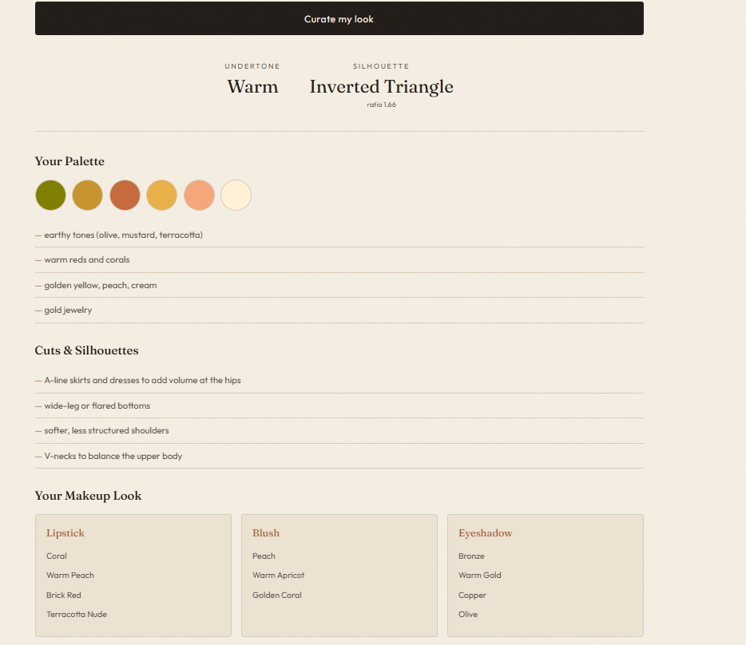

<h1 align="center">👗 Style & Glow — AI Personal Styling Assistant</h1>

<p align="center"><b>AI-Powered Fashion & Beauty Recommendation System using Computer Vision</b></p>

<p align="center">
  
  
  
  
  
  
</p>

---

## Overview

**Style & Glow** is a full-stack web app that analyzes a person's photos to recommend a flattering **color palette**, **clothing silhouettes**, and a **makeup look**. It reads skin undertone from a face photo and body shape from a full-body photo using computer vision, then maps those features to personalized styling recommendations.

The user uploads two photos — a clear face close-up and a full-body standing shot — and gets back a curated wardrobe palette, flattering cuts, and makeup shades (lipstick, blush, eyeshadow).

---

## Screenshots

<p align="center">
  
</p>

<p align="center">
  
</p>

---

## How it works

1. The user uploads two photos — a clear face close-up and a full-body standing shot.
2. The backend detects the **face** (MediaPipe) and selects the primary face, then samples a central skin patch and uses **KMeans clustering** to find the dominant skin color.
3. The **undertone** (warm / cool / neutral) is classified from the relationship between the red and blue channels.
4. **Body landmarks** are detected with **MediaPipe Pose**, and the **body shape** is estimated from the shoulder-to-hip ratio.
5. The app returns personalized recommendations: wardrobe colors, flattering cuts, and a makeup look.

---

## Tech stack

**Backend**
- Python 3.12
- FastAPI (REST API)
- OpenCV (image handling)
- MediaPipe (face detection + pose estimation)
- scikit-learn (KMeans clustering for dominant skin color)
- NumPy

**Frontend**
- React (Vite)
- CSS (editorial / fashion-magazine styling)

A simple HTML/JS frontend (`frontend/`) was also built first, before the React version.

---

## Project structure

```
dress-recommender/
├── data/                 # Sample test images (face + body)
├── src/                  # Backend: analysis + API
│   ├── load_image.py         # Load & display an image
│   ├── face_detection.py     # Face detection + primary-face selection
│   ├── skin_tone.py          # Skin patch -> KMeans dominant color -> undertone
│   ├── body_detection.py     # Pose landmarks -> shoulder/hip ratio -> body shape
│   ├── analyze_skin.py       # Reusable skin analysis function
│   ├── analyze_body.py       # Reusable body analysis function
│   ├── recommender.py        # Maps undertone + shape -> colors, cuts, makeup
│   ├── main.py               # Runs the full pipeline locally (CLI)
│   └── api.py                # FastAPI server exposing /analyze
├── frontend/             # Simple HTML/JS frontend (first version)
│   └── index.html
├── frontend-react/       # React frontend (current)
│   └── src/App.jsx
└── README.md
```

---

## Running the project

### 1. Backend

```bash
# from the project root, with a Python 3.12 virtual environment active
pip install fastapi "uvicorn[standard]" python-multipart opencv-python mediapipe numpy scikit-learn

cd src
uvicorn api:app --reload
```

The API runs at `http://127.0.0.1:8000`.
Interactive docs (test the `/analyze` endpoint here): `http://127.0.0.1:8000/docs`

### 2. Frontend (React)

```bash
cd frontend-react
npm install
npm run dev
```

Open the URL Vite prints (usually `http://localhost:5173`). Keep the backend running in a separate terminal.

---

## API

### `POST /analyze`

**Request:** `multipart/form-data` with two image files — `face` and `body`.

**Response:**
```json
{
  "undertone": "Warm",
  "rgb": [179, 151, 131],
  "body_shape": "Inverted Triangle",
  "ratio": 1.66,
  "colors": ["earthy tones (olive, mustard, terracotta)", "..."],
  "cuts": ["A-line skirts and dresses to add volume at the hips", "..."],
  "makeup": {
    "lipstick": ["coral", "warm peach", "..."],
    "blush": ["peach", "warm apricot", "..."],
    "eyeshadow": ["bronze", "warm gold", "..."]
  }
}
```

---

## Known limitations

- **Body-shape accuracy depends heavily on the input photo.** Loose or flowing clothing causes MediaPipe to misestimate hip width, which skews the shoulder-to-hip ratio. Best results come from fitted clothing, a straight-on stance, and arms held slightly away from the body.
- **Undertone classification uses a simple red-blue rule**, which is sensitive to lighting conditions. A more robust version would work in the LAB color space.

---

## Possible future work

- Replace the rule-based recommender with a trained ML classifier (e.g. XGBoost on a hand-labeled dataset) to predict a seasonal color palette
- Convert undertone detection to LAB color space for lighting robustness
- Add waist estimation for more accurate body-shape classification
- Map recommendations to specific Indian makeup brand products (Lakme, Sugar, Nykaa, MAC India)
- Deploy the backend and frontend for a public demo

---

## Author

**Nancy**
